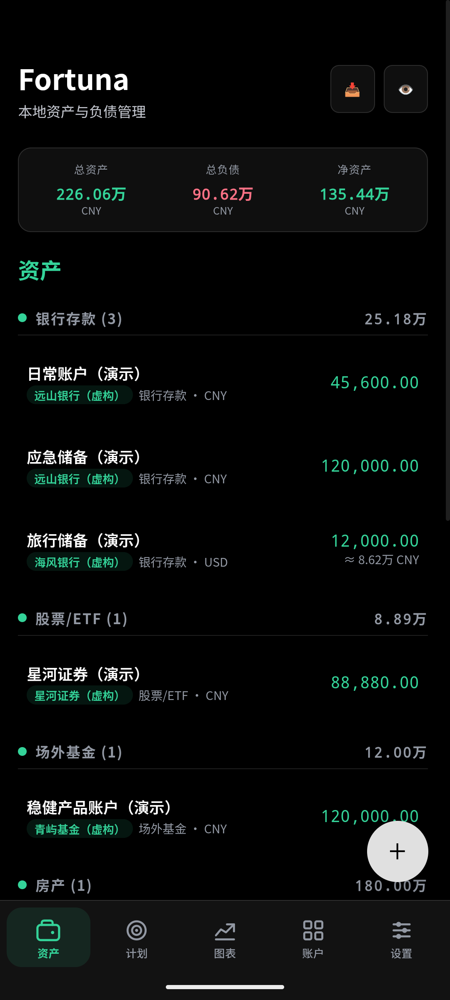
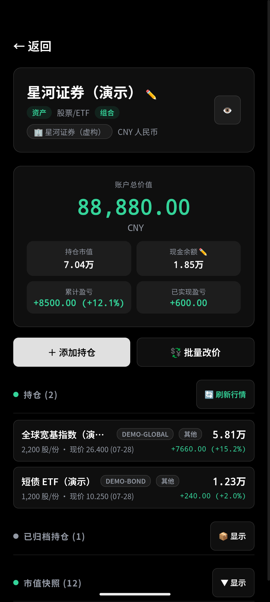
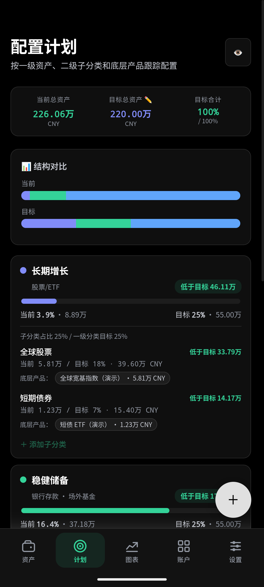
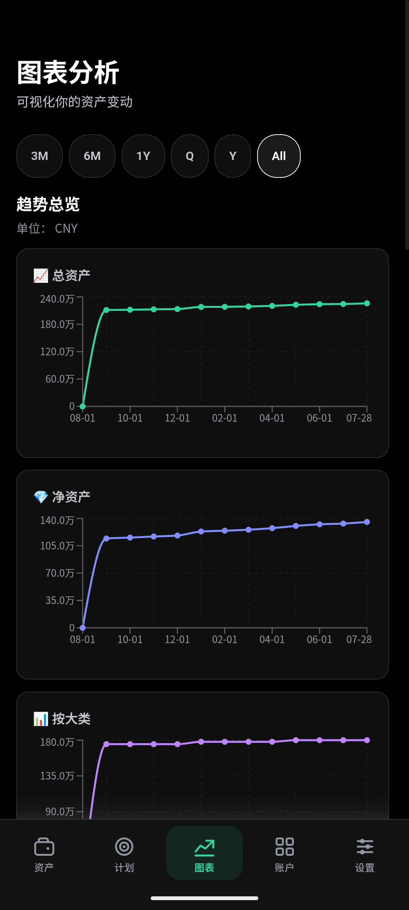
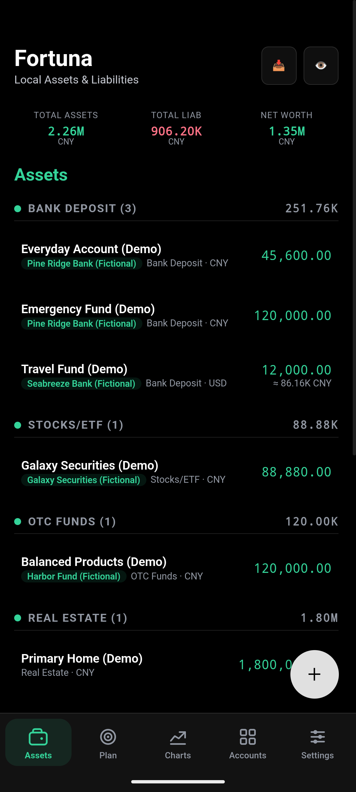
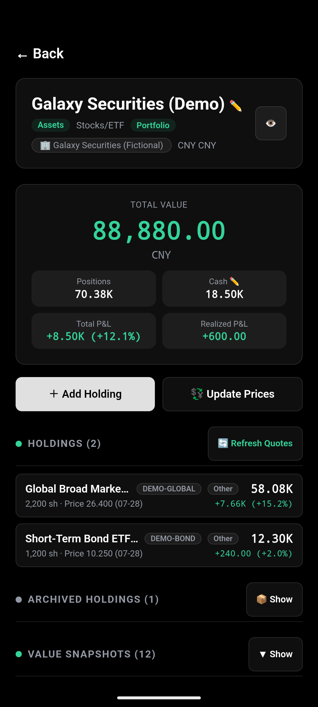
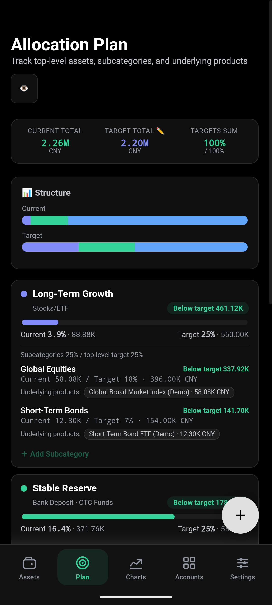
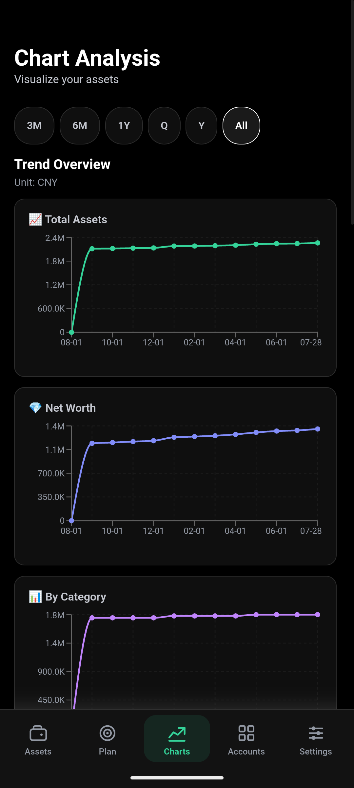

# Fortuna

[中文](#中文) · [English](#english)

[](https://github.com/charlotteamian/Fortuna/releases/latest)
[](https://github.com/charlotteamian/Fortuna/actions/workflows/android-apk-release.yml)
[](LICENSE)

<a id="中文"></a>

## 中文

**Fortuna 把分散的资产、不断变化的市场价格、抽象的配置计划和您自己的数据工作流连接成一套本地资产管理闭环。**

它不只是记录“我有多少钱”，而是帮助您回答四个持续发生的问题：我的资产究竟散落在哪里？现在值多少钱？离自己的规划还有多远？这些数据能不能始终由我掌握并继续使用？

### 四项核心能力

| 核心能力 | Fortuna 解决的问题 |
| --- | --- |
| **1. 把散落资产归集到一处** | 将银行、券商、基金平台、现金、房产、信用卡和贷款统一到一张多币种资产负债表。一个平台可作为组合账户，继续管理其中的现金、股票、基金、期权、存款或理财产品；每项还可独立选择是否计入总额或暂时隐藏。 |
| **2. 让价格自动回到持仓** | 对支持的 A 股、港股、美股和 ETF、国内场外基金、美股期权、黄金等贵金属以及外汇汇率自动尝试刷新。进入组合账户时会静默更新，也可一键手动刷新，不必再到多个平台逐项搜索价格。 |
| **3. 把资产规划和真实持仓连起来** | 设置一级目标和二级子目标，并直接关联具体账户、持仓或组合现金。Fortuna 会计算当前占比、目标金额、差额和完成进度；同一笔资产分配给多个目标时按实际金额处理，避免重复计算。 |
| **4. 本地保存，但不把数据困在 App 里** | 账本默认只保存在本机。资产页可导出图片报告或分类 Excel，设置中可生成可恢复的完整 Excel 备份；还可授权 App 把机器可读 JSON 写入指定目录。若选择云盘同步目录，手机更新后，电脑上的个人脚本或 AI 工作流即可读取最新快照。 |

### 它和普通资产管理 App 有什么不同

- **不是只看余额：**既保留账户全景，也能管理组合内的现金、持仓、交易、已实现/未实现盈亏和已归档仓位。
- **不是单独的行情工具：**价格更新直接作用于自己的真实持仓和总资产估值，而不是查完价格再手工抄回账本。
- **不是一张静态配置饼图：**计划可以绑定实际账户、持仓和现金，让“目标配置”与“已经做到哪一步”持续对照。
- **不是必须把账本交给开发者云端：**Fortuna 不要求账户登录，也没有开发者运营的财务数据库；备份、导出、云盘与外部 AI 均由用户选择和授权。
- **不是封闭的数据孤岛：**同一份本地数据既能在手机中管理，也能通过 Excel 或结构化快照进入您自己的电脑端分析流程。

> Fortuna 是资产记录与估算工具，不提供投资、税务、法律或借贷建议，也不会自动交易。行情可能因休市、延迟、代码填写或第三方接口而暂时不可用；此时 App 会保留上次有效价格，并显示价格日期。

### 中文示意图

以下截图全部使用 [`demo/`](demo/README.md) 中的中文纯模拟数据。

<table>
  <tr>
    <td align="center"><br><sub>全资产归集</sub></td>
    <td align="center"><br><sub>持仓、现金与价格更新</sub></td>
    <td align="center"><br><sub>规划与实际持仓对照</sub></td>
    <td align="center"><br><sub>历史与结构分析</sub></td>
  </tr>
</table>

### 体验中文演示

1. 下载 [`Fortuna-Demo-Portfolio.xlsx`](demo/Fortuna-Demo-Portfolio.xlsx)。
2. 在 Fortuna 打开 **设置 → 数据备份与恢复 → 恢复数据**。
3. 选择演示文件。导入会替换当前本地数据库，请先备份自己的数据。

演示文件中的账户、机构、标识符、余额、价格和交易全部为虚构内容，不包含任何真实个人财务数据。

### Android 安装与数据边界

1. 打开[最新 GitHub Release](https://github.com/charlotteamian/Fortuna/releases/latest)。
2. 在 Android 设备下载 `Fortuna-*-debug.apk`。
3. 打开文件，并在系统提示时允许当前浏览器或文件管理器安装应用。

GitHub APK 是用于个人、非商业使用的 debug 签名侧载版本。账本保存在 App 的 IndexedDB；行情查询只发送公开的币种、金属、基金或证券代码，不发送账户余额。可选 JSON 快照只在用户选择目录并授权后启用；云盘同步和外部 AI 分析由用户自己的服务完成，并非 Fortuna 内置云服务。

---

<a id="english"></a>

## English

**Fortuna connects scattered assets, changing market prices, allocation plans, and your own data workflows into one local-first wealth-management loop.**

It goes beyond recording a balance. Fortuna helps answer four recurring questions: Where is everything held? What is it worth now? How far have I progressed toward my plan? Can I keep control of the data and reuse it elsewhere?

### Four core capabilities

| Core capability | What Fortuna solves |
| --- | --- |
| **1. Consolidate scattered assets** | Bring banks, brokers, fund platforms, cash, property, cards, and loans into one multi-currency balance sheet. A platform can be a portfolio account containing cash, equities, funds, options, deposits, or other products; each account can be independently included in totals or hidden from regular views. |
| **2. Bring prices back to the holdings** | Automatically attempt to refresh supported A-share, Hong Kong, US equity and ETF quotes, Chinese OTC funds, US equity options, precious metals such as gold, and FX rates. Portfolio accounts refresh silently when opened and can also be updated manually—without checking each provider one by one. |
| **3. Connect allocation plans to real positions** | Create top-level goals and nested targets, then link exact accounts, holdings, or portfolio cash. Fortuna shows current weight, target amount, gap, and progress; shared assets are allocated by real amount instead of being counted twice. |
| **4. Keep data local without trapping it** | The ledger stays on-device by default. Export an image report or category Excel report, create a complete restorable Excel backup, or authorise a machine-readable JSON snapshot in a chosen folder. If that folder is cloud-synced, a personal script or AI workflow on your computer can read the updated snapshot after you change a position on your phone. |

### How it differs from a typical asset tracker

- **More than account balances:** manage portfolio cash, positions, transactions, realised/unrealised P&L, and archived holdings inside the overall balance sheet.
- **More than a quote lookup:** supported market prices flow back into your own holdings and total valuation instead of being copied manually from another app.
- **More than a static allocation chart:** targets are linked to actual accounts, holdings, and cash, so the app shows progress toward the plan.
- **No mandatory developer cloud:** Fortuna requires no login and has no developer-operated financial database. Backup, export, cloud sync, and external AI access remain user-controlled choices.
- **Not a closed data silo:** the same local ledger can continue into your own desktop analysis through Excel or a structured snapshot.

> Fortuna is a record-keeping and estimation tool, not investment, tax, legal, or lending advice, and it does not trade automatically. Quotes can be delayed or unavailable because of market hours, identifiers, or third-party services. The app keeps the last valid price and exposes its date.

### English screenshots

Every screenshot below uses the English synthetic dataset in [`demo/`](demo/README.md).

<table>
  <tr>
    <td align="center"><br><sub>Consolidated assets</sub></td>
    <td align="center"><br><sub>Holdings, cash, and quote updates</sub></td>
    <td align="center"><br><sub>Plan versus actual positions</sub></td>
    <td align="center"><br><sub>History and structure</sub></td>
  </tr>
</table>

### Try the English demo

1. Download [`Fortuna-Demo-Portfolio.en.xlsx`](demo/Fortuna-Demo-Portfolio.en.xlsx).
2. In Fortuna, open **Settings → Data Backup & Restore → Import Data**.
3. Select the workbook. Import replaces the current local database, so export your own backup first.

Every account, institution, identifier, balance, price, and transaction is fictional. No personal financial data is included.

### Android install and data boundary

1. Open the [latest GitHub Release](https://github.com/charlotteamian/Fortuna/releases/latest).
2. Download `Fortuna-*-debug.apk` on the Android device.
3. Open it and allow installation from that browser or file manager if Android asks.

The GitHub APK is a debug-signed sideload build for personal, non-commercial use. Records live in the app's IndexedDB. Quote requests send public currency, metal, fund, or security identifiers—not account balances. The optional JSON snapshot starts only after the user selects and authorises a folder. Cloud sync and external AI analysis are provided by the user's chosen services, not by a Fortuna cloud backend.

---

## Development / 开发

### Technology

- React 19 + TypeScript 6 + Vite 8
- Capacitor 8 Android and iOS shells
- Dexie 4 / IndexedDB local persistence
- Recharts 3 visualisations
- i18next Chinese/English localisation
- SheetJS Excel import/export

### Build from source

Requirements: Node.js 24+. Android builds also need Java 21 and the Android SDK; App Store builds need Xcode 26 or later and an active Apple Developer signing team.

```bash
npm ci
npm run lint
npm run build
npx cap sync android
cd android && ./gradlew assembleDebug
```

Useful commands:

```bash
npm run dev            # Vite development server
npm run demo:generate  # rebuild both synthetic JSON and Excel demo sets
npm run release:web    # lint, build, and sync Android web assets
npm run release:ios    # test, build, sync, and verify the current iOS bundle
npm run archive:ios    # create a signed App Store archive (requires build number/signing)
```

For a signed Play Store bundle, configure an upload key and run `bash scripts/build-release-aab.sh`. Publishing notes live in [`docs/play-store-release.md`](docs/play-store-release.md). App Store materials live in [`release/app-store/`](release/app-store/).

### Repository layout

```text
src/                    React application, database, services, and domain logic
android/                Capacitor Android project
scripts/                tests, release helpers, and bilingual demo generator
demo/                   Chinese and English synthetic JSON/Excel datasets
docs/screenshots/       Chinese screenshots
docs/screenshots/en/    English screenshots
release/play-store/     store listing, privacy, and publishing materials
.github/workflows/      reproducible Android APK release workflow
```

See [`CHANGELOG.md`](CHANGELOG.md), [GitHub Releases](https://github.com/charlotteamian/Fortuna/releases), and the bundled [privacy policy](release/play-store/privacy-policy.md).

## License / 许可

Fortuna is source-available for personal, private, non-commercial use. Commercial use, commercial distribution, and redistribution of modified versions require prior written permission from the copyright holder. See [`LICENSE`](LICENSE).
